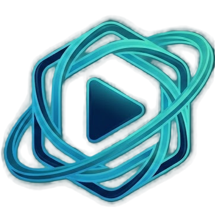
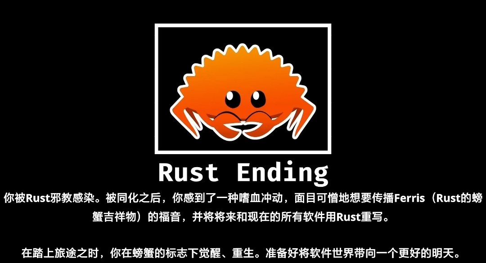

<!-- markdownlint-disable MD033 MD026 MD034 -->

> ⚖️ 本项目为开源、本地优先的软件，仅用于学习 Rust / Tauri / 现代 Web 技术与技术研究，不提供任何影视内容。

<div align="center">
  
  <h1>QuantumTV</h1>
</div>

> 🎬 **QuantumTV** 是一个开箱即用的、跨平台的本地影视聚合播放器，支持 **Windows、macOS、Linux以及Android**。它基于 **Next.js** + **Tauri** 构建，让你可以在桌面端便捷地管理与播放用户自行配置的影视资源。**支持多源搜索、在线播放、播放记录、本地无数据库零隐私泄露、CMS 全量代理、隐私纵深防御等企业级特性。**

<p align="center">
  <a href="https://rust-lang.org/">
    
  </a>
  <a href="https://nextjs.org/">
    
  </a>
  <a href="https://tauri.app/">
    
  </a>
  <a href="https://react.dev/">
    
  </a>
  <a href="https://tailwindcss.com/">
    
  </a>
  <a href="https://www.typescriptlang.org/">
    
  </a>
  <a href="LICENSE">
    
  </a>
</p>

---

### ⚠️ 重要提醒

> **注意**：部署后项目为**空壳项目**，无内置播放源，所有内容资源需用户自行收集与配置。  
> **免责声明**：请不要在 B 站、小红书、微信公众号、抖音、今日头条或其他中国大陆社交平台发布视频或文章宣传本项目，不授权任何"科技周刊/月刊"类项目或站点收录本项目。  
> **学习用途声明**：本项目主要用于 Rust / Tauri / 现代 Web 技术的学习、研究与技术实践，不以内容分发或商业使用为目的。  
> **责任边界声明**：用户因自行配置第三方资源、使用或传播本项目所产生的任何法律风险与后果，均由用户本人承担，项目作者及贡献者不承担任何责任。  
> **隐私保护声明**：项目无账号体系、不上传播放行为，本地模式下用户数据仅保存在本地环境中。

## ✨ 为什么选择 Tauri + 本地模式

- ⚡ **轻量高性能桌面应用**：基于 Tauri + 系统原生 WebView，安装包体积小、启动快、内存占用远低于 Electron。
- 🦀 **Rust 安全边界**：核心能力由 Rust 提供，明确的权限模型，无 Node.js Runtime 暴露，显著降低安全风险。
- 🖥️ **真正的原生桌面体验**：支持原生窗口、快捷键、托盘及本地文件系统访问，体验优于 PWA。
- 🏠 **Local-First 本地优先**：播放记录、收藏、配置文件可完全存储在本地，不依赖任何中心化服务。
- 🗄️ **无数据库也可运行**：本地模式下无需 Redis / 数据库，浏览器使用 localStorage 即可工作。
- 🌐 **更自由的网络能力**：桌面端不受浏览器限制，配合 CMS 全量代理彻底解决 CORS 与 Mixed Content。
- 🛡️ **隐私纵深防御**：无账号体系、不上传播放行为，本地模式下隐私暴露面极低。
- 🔌 **去中心化架构**：项目本身不提供内容，只是一个可高度自定义的播放器引擎。
<div align="center">
  
</div>

## 🏛️ 项目架构

QuantumTV 采用现代化的混合应用架构，在一个代码仓库中管理桌面端应用：

- **🖥️ 桌面端**: 基于 **Tauri** 框架，将 Next.js 前端打包为轻量、高效的本地应用，支持 Windows、macOS 和 Linux。这种架构实现了代码的最大化复用，同时为不同平台提供了最佳的用户体验。
- **📱 移动端（Android）**: 同样基于 Tauri 的移动端支持，复用现有的 Next.js 前端代码，通过原生 WebView 构建 Android 应用。在保证统一技术栈和开发效率的前提下，结合 Android 平台特性，实现良好的性能表现与一致的用户体验。

## 🛠 技术栈

| 分类      | 主要依赖                                                                                             |
| --------- | ---------------------------------------------------------------------------------------------------- |
| 核心框架  | [Next.js 16](https://nextjs.org/) · [Tauri 2](https://tauri.app/)                                    |
| 前端      | [React 19](https://react.dev/)                                                                       |
| UI & 样式 | [Tailwind CSS 4](https://tailwindcss.com/)                                                           |
| 语言      | [Rust](https://www.rust-lang.org/) · [TypeScript 5](https://www.typescriptlang.org/)                 |
| 播放器    | [ArtPlayer](https://github.com/zhw2590582/ArtPlayer) · [HLS.js](https://github.com/video-dev/hls.js) |

## ⚙️ 配置文件

部署后为空壳应用，需要管理员在后台的 "配置文件" 设置中填写资源（后续将支持订阅）。

配置文件示例如下：

```json
{
  "cache_time": 7200,
  "api_site": {
    "dyttzy": {
      "api": "http://xxx.com/api.php/provide/vod",
      "name": "示例资源",
      "detail": "http://xxx.com"
    }
    // ...更多站点
  },
  "custom_category": [
    {
      "name": "华语",
      "type": "movie",
      "query": "华语"
    }
  ]
}
```

- `cache_time`: 接口缓存时间（秒）。
- `api_site`: 资源站列表。`key` 为唯一标识，`api` 为资源站 VOD 接口地址，`name` 为显示名称。
- `custom_category`: 自定义首页分类。

## 🔒 安全与隐私

- **个人使用**: 为了您的数据安全与隐私，请**不要在公共计算机、共享服务器或他人可访问的环境中部署**并请仅限个人或家庭网络使用。
- **数据与隐私责任**: 项目本身不提供、存储或分发任何影视内容，也不会主动收集用户隐私数据。所有播放源、配置及使用行为均由用户自行管理与承担责任。
- **法律责任**: 请在使用本项目前，请遵守当地法律法规。用户对自己的使用行为负责，因用户自行配置第三方资源或使用本项目产生的任何法律风险与后果，**均由用户本人承担**，项目作者及贡献者不承担任何责任。
- **服务地区**: 本项目不面向中国大陆地区提供任何形式的服务、运营或内容分发。任何在该地区的使用行为均属于用户个人行为，与本项目及其开发者无关。

## 📄 License

[MIT](LICENSE) © 2025 QuantumTV & Contributors

## 🙏 致谢

- [DecoTV](https://github.com/Decohererk/DecoTV/releases/tag/v1.1.0) — 本项目的二次开发基础，为 QuantumTV 提供了重要的架构与功能参考。
- [ArtPlayer](https://github.com/zhw2590582/ArtPlayer), [HLS.js](https://github.com/video-dev/hls.js) — 核心播放器
- [Zwei](https://github.com/bestzwei), [CMLiussss](https://github.com/cmliu) — 豆瓣数据服务
- 以及所有为学习与研究目的提供公开数据接口的站点与社区！

## 📈 Star History

[](https://www.star-history.com/#Geon97/QuantumTV&type=date&legend=top-left)

---

<div align="center">
  <p>
    <strong>🌟 如果觉得项目有用，请点个 Star 支持一下！🌟</strong>
  </p>
  <p>
    <sub>Made with ❤️ by <a href="https://github.com/Geon97">Geon97</a> and <a href="https://github.com/Geon97/QuantumTV/graphs/contributors">Contributors</a></sub>
  </p>
</div>
